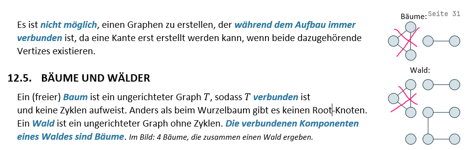

### Druck
Druck A5 pro Seite, also für den normalen Druck auf A4 Papier wähle die Einstellung 2 Seiten pro Blatt und ich empfehle einseitig zu drucken (Mehr Platz für Notizen und einfacheres blättern). 

Zusätzlich habe ich den Code der Übungen ausgedruckt, 4 Seiten pro Blatt. War praktisch um die Übungen nochmals zu studieren und Notizen zu machen zum Code. An der Prüfung habe ich es für die Programmieraufgaben nicht benötigt. Dort würde ich den OOP1 oder OOP2 Spick empfehlen mitzunehmen, wenn man unsicher mit Java Syntax ist.

### Neue Version von Jasmin

- Rechtschreibkorrektur
    - S. 7 "schneiden", Kommas
    - "Repäsentation" "Repräsentation
- Inhalt: Texte vereinfacht, ergänzt, entfernt. Doppelte Information bei anderen Unterthemen weggelassen.
    - Text durch Bilder ersetzt. Die Idee ist, dass einige Details/Konzepte "logisch" sind oder abgelesen werden können.
    - dynamische Programmierung neues Vorgehen
    - Bei Bäume und Wälder, der Graph mit Zyklen war kein Baum, deshalb habe ich diesen durchgestrichen: 
    - Der Pseudocode für KMP, Failure Function, Bruteforce und dyn. Programmierung wurde neu hinzugefügt.
- Seitenumbrüche hinzugefügt, damit wird ein Titel schneller gefunden und zusätzlicher Platz für eigene Notizen.
- Grafiken angepasst
    - zu helle Linien bei Grafiken abgedunkelt
    - S.30 Subgraphen die dünnen Kanten auf Bild schlecht lesbar ausgedruckt
    - Vorlesungsgrafik eingefügt als SVG bei Bellman Ford
    - S. 29 Kanten Listen Struktur bei Grafik war eine Kante c statt d beschriftet.
    - weitere kleine Korrekturen (Zahlen)
    - Bei der Datei mit Vektorgrafiken habe ich das Layout geändert und auch die Namen der "ArtBoards" geändert.
- Weniger wichtige Texte kleine gemacht und Grafiken vergrössert
- Notizen von Papier übernommen, z.B. Pfeile
- und mehr

Es "fehlt" das Vorgehen bei Last-Occurence und KMP Match, das sollte man auswendig können und die Zusammenfassung nur als Hilfe nehmen. Die Zusammenfassung ersetzt nicht die Vorlesungen. 

#### Um Pseudocode mit Syntax Highlighting zu erstellen
In Jetbrains den filetype .pcode erstellen mit den Zeichen gemäss [Pseudocode-Syntax-Highlighting](Archiv/Pseudocode-Syntax-Highlighting.pcode)
In Word kopieren von IntelliJ behält die Formatierungen (Farben). Wenn der gesamte Code Absatz ausgewählt wird kann die Formatvorlage "Code" darauf angewendet werden und die Farben bleiben bestehen.
