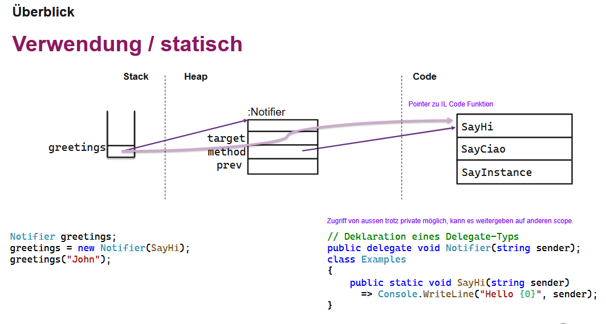

## Druck
Ausgedruckt auf A5 farbig, also einfach A4 Druck mit 2 Seiten pro Blatt und einseitig.
\+ PDFs von "weitere-Unterlagen"

## Hinweise zur Zusammenfassung
- die Version von NG ist etwas vollständiger, evt. einfacher zu verstehen
- Deterministic Finalization nochmals verbessern
- mein Nullability und Record Kurzfassung kann weggelassen werden
- paar Notizen auf Papier gemacht, könnten ergänzt werden (z.B. Typ Hierarchie für Reflection ohne Fehler). 

## Weiteres zum ausdrucken
Siehe im Ordner "weitere-Unterlagen". 

### Beispiele
 auf S. 509 auf A4

das fehlt bei grpc?
 S. 659 auf A5/A6

Initialisierungsreihenfolge Bild S.165 auf A5/A6

Bilder zu klein auf A5 Druck S.267-268, deshalb noch separat auf A5 ausgedruckt
