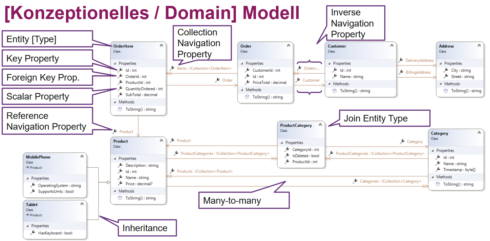
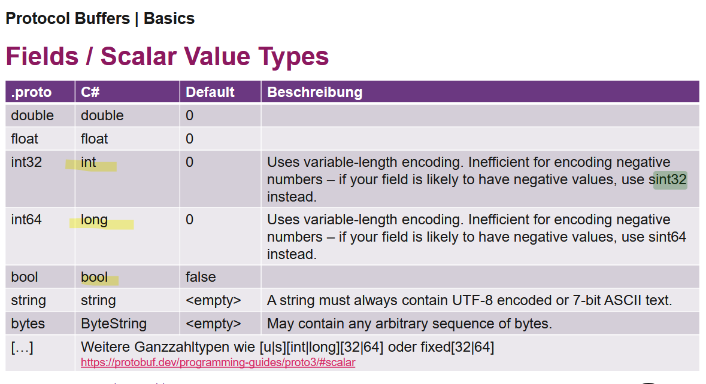
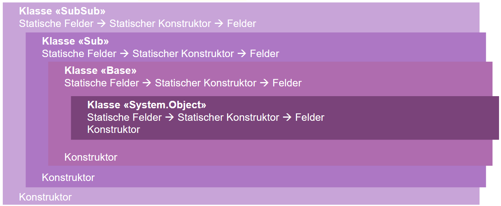

- die Version von NG ist etwas vollständiger, evt. einfacher zu verstehen
- Deterministic Finalization nochmals verbessern
- mein Nullability und Record Kurzfassung kann weggelassen werden
- paar Notizen auf Papier gemacht, könnten ergänzt werden (z.B. Typ Hierarchie für Reflection ohne Fehler)

 auf S. 509

das fehlt bei grpc?
 S. 659

Initialisierungsreihenfolge Bild S.165 
