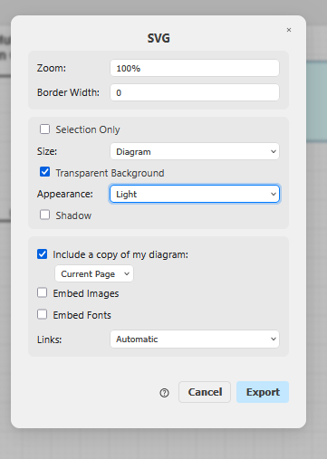

Benutze eine angepasste Version vom Cheatsheet template von Nina und Jannis.

## draw.io
- einfache Bearbeitung mit VSCode draw.io Extension, aber das svg wird nicht richtig gerendert.
- Bei Textproblemen gibt es bei der online https://app.diagrams.net/ Seite diese Option "Convert Labels to SVG". 
- unter "WE2-diagramme.drawio" mit verschiedenen Seiten

export bei https://app.diagrams.net/# oder https://jasmin-f.github.io/drawio/src/main/webapp/index.html#
Export so: 

oder so:

TODO:
- export einstellungen anpassen, damit Strichdicken gleichbleiben, zoom vielleicht?

<!-- pdf export und einfügen testen. -->