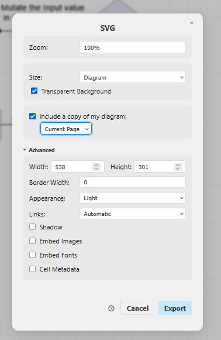

## Typst
Für Typst Cheatsheets benutze ich eine angepasste Version vom Cheatsheet template von Nina und Jannis.
Deshalb ist der Export von ihren Zusammenfassungen nicht exakt gleich.

## SVGs / Vektorgrafiken
### Affinity Designer (empfohlen)
Ist angenehmer, vorallem der Batch-Export ist praktisch. 

### draw.io SVG (alt)
- einfache Bearbeitung mit VSCode draw.io Extension, aber das svg wird nicht richtig gerendert.
- Bei Textproblemen gibt es bei der online https://app.diagrams.net/ Seite diese Option "Convert Labels to SVG". 
- unter "WE2-diagramme.drawio" mit verschiedenen Seiten

export bei https://app.diagrams.net/# oder https://jasmin-f.github.io/drawio/src/main/webapp/index.html#
Export so: 

oder so:

TODO:
- export einstellungen anpassen, damit Strichdicken gleichbleiben, zoom vielleicht?

### Druckerproblem wegen Farben
Keine Transparenzen Farben verwenden (auch im SVG) und am Besten die RGB Farben in CMYK umwandeln.

### Drucker überfordert mit SVG
dann drucke auf der Rückseite die mittlere Spalte separat aus (Blatt neu in den Drucker geben).

1. markiere beim nächsten Papier im Drucker, wo der obere, äussere Ecken ist (z.B. Kreis mit Bleistift)
2. einen Teil der schwierigen Seite drucken
3. Papier wieder gleich in den Drucker reinlegen, Markierung am gleichen Ort wie vorher
2. Drucke einen weiteren Teil der schwierigen Seite aus
3. widerholen
4. am Schluss das Papier umgedreht reinlegen und die andere Seite ausdrucken

Problem
- UTF-16 Bild wahrscheinlich, ansonsten die ASCII Tabelle
- möglicherweise weil ich Transparenz benutzt habe im Vektor

### SVG aus PDF Workflow
- PDF Seiten extrahieren (PDF24, PDFSam)
- PDF in Inkscape öffnen, das gewählte Blatt importieren (Poppler/Cairo import)
- SVG in Affinity Designer copy+pasten
- Auswahl um ganzes SVG und Arbeitsfläche aus Auswahl erstellen
- Export als SVG im Export-Tab (mit Text als Kurven, nicht Rastern und so)

## Drucker
Einstellungen
- Firefox
- Farbig, A4, Scale: Fit to page width
- Margins: Default

Drucker in der Schule: mit 600dpi (standard) wird Schrift etwas "dick" aber mit 1200dpi sind die hellgrauen Code-Kommentare bisschen schwer lesbar (viell. Farbe ändern in typst?)

### Schriften
Stelle sicher, dass du die Schriften installiert hast, ansonsten passt der Spick möglicherweise nicht auf die 2 Seiten. \
Die Schriften sind im Template, wichtig sind mindestens:
- Calibri
- Calibri bold
- JetBrains Mono

### Export / Kompilieren
Von Hand kompilieren
`typst compile Bsys2/Bsys2_Spick_FS26_JF.typ --root .`

